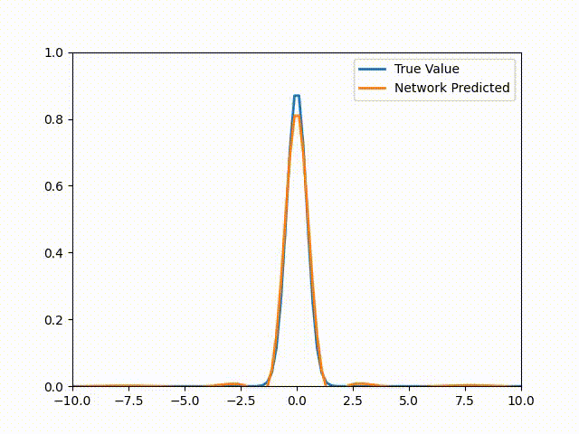

# PINN_Tutorial

This notebook details how to create PINN using Pytorch. Theres is a custom class I have implemented that should make this in a much easier fashion (There is a lot of indexing when using functorch otherwise).

This code will allow you to create a PINN for the 1D Heat/Diffusion Equation:
$$
\frac{\partial u^2 }{\partial t^2} = k \frac{\partial u^2 }{\partial x^2}
$$

You can also run this notebook on github [here](https://colab.research.google.com/drive/1xsCCTBJABVJnLBroBZ3Dnj_lv_vvS5Ok?usp=sharing):

Please see the accompanying blog post [here]() for more information.